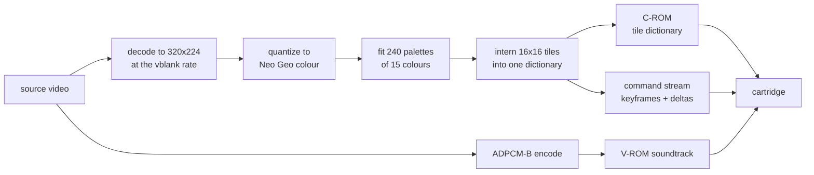
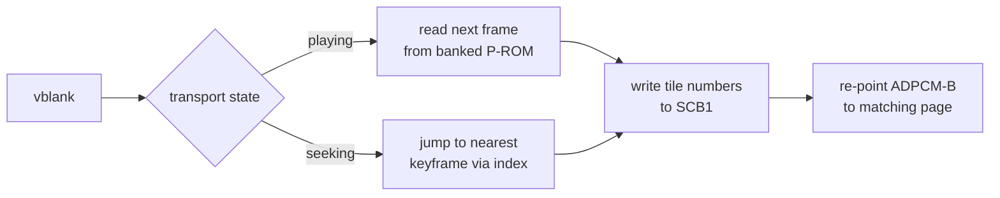

# AES Movie Player

Play a real movie on a stock Neo Geo AES. Full screen at 320x224, colour,
mono soundtrack, and a working transport: play, pause, fast forward at 2x,
5x and 10x, rewind, and seek.

The console has no video decoder, no framebuffer, and no scaler. It draws
hardware sprites and that is all. So the movie is not decoded on the
console at all. An offline baker turns a video file into cartridge ROM
images, and the on-cart player does nothing at runtime but push pre-computed
tile numbers into sprite control blocks once per vblank.

A ten minute movie fits in a 139 MB cartridge, plays at 14.8 fps with sound,
and reproduces bit-exactly what the baker predicted.

## Contents

- [How it works](#how-it-works)
- [Hardware ceilings](#hardware-ceilings)
- [The quality system](#the-quality-system)
- [Per-scene palettes](#per-scene-palettes)
- [Rate control](#rate-control)
- [Colour](#colour)
- [Usage](#usage)
- [Verification](#verification)
- [What did not work](#what-did-not-work)
- [Hardware notes worth knowing](#hardware-notes-worth-knowing)
- [Repository layout](#repository-layout)

## How it works

The screen is a fixed grid of 20 by 14 hardware sprite tiles, 280 slots of
16x16 pixels covering the 320x224 raster. Every distinct tile the whole
movie needs is interned once into a global dictionary in character ROM.
A frame is then just a list of assignments: slot 137 now shows tile 90412.



At runtime the player reads the next frame's commands and writes them
straight to sprite control block 1. There is no decompression step, because
a tile number *is* the decoded form.



**A frame that changes nothing costs two bytes.** A 24 fps source shown on a
59.185 Hz raster repeats each frame about 2.47 times, and every repeat is
free. Over ten minutes the stream averages 16.7 slot updates per frame out
of 280.

**Keyframes rewrite all 280 slots** and act as seek targets. The transport
can jump anywhere by finding the nearest keyframe in an index and replaying
from there. A ten minute movie carries 716 of them.

**There are no residuals.** With no framebuffer, a correction cannot add a
difference to what is on screen. It can only point a slot at some tile that
already exists in the dictionary. Picture quality is therefore dictionary
richness, and dictionary richness is character ROM. That single fact shapes
every design decision below.

## Hardware ceilings

Read from the source of two independent emulators rather than from prose.

| Resource | Ceiling | Consequence |
|---|---|---|
| Character ROM | 20-bit tile number, 1,048,576 tiles, 128 MiB | The binding constraint at every quality tier |
| Program ROM | 3-bit bank latch, 8 banks of 1 MiB | Command stream. Used 3.0 MB for ten minutes, never close |
| ADPCM-B voice ROM | 16 MiB of 4-bit samples, reached through a 16-bit page counter | About 10 minutes at the chip's 55.6 kHz ceiling. Longer sources get the highest rate that still ends on an addressable page |
| Sprites per scanline | 96 | The grid uses 20 |
| Palettes | 256 banks of 16 colours, index 0 transparent | 240 for video, 16 reserved for the menu |
| Watchdog | about 0.13 seconds | Bounds any initialisation loop |

**There is no character-ROM bankswitching, and there cannot be.** Neither
geolith nor MAME implements it on any board, including every bootleg mapper
MAME carries, and the arithmetic forbids it: 2^20 tiles at 128 bytes each is
exactly the 128 MiB the tile number addresses. 128 MiB is an absolute
ceiling, not a window. An early design assumed 8 banks of it and was wrong.

## The quality system

Tile cost is a property of the content, not of the running time. Dense
animation can cost several times what a dialogue scene costs, so a ladder
indexed by duration alone would over-compress easy sources and
under-compress hard ones. The baker measures the source instead.

```bash
uv --project tools run python -m aesmovie.plan --source film.mkv
```

```
Source
  film.mkv
  9:56 runtime, 1280x720, 24.00 fps, audio present

Calibration
  measured 102,271 tiles per minute at 'q09'

Quality ladder for this source
  tier      picture                                  fps     holds               verdict
  ------------------------------------------------------------------------------------
  q01       every frame, colour at 100%             59.2      4:29          over by 5:49
  q02       every frame, colour at 89%              59.2      4:57          over by 5:24
  q03       every frame, colour at 79%              59.2      5:27          over by 4:56
  q04       every frame, colour at 70%              59.2      6:01          over by 4:25
  q05       every frame, colour at 62%              59.2      6:38          over by 3:51
  q06       every frame, colour at 54%              59.2      7:18          over by 3:14
  q07       every frame, colour at 48%              59.2      8:03          over by 2:33
  q08       every frame, colour at 42%              59.2      8:52          over by 1:47
  q09       every frame, colour at 37%              59.2      9:46          over by 0:57
  q10       every frame, colour at 31%              59.2     10:46          over by 0:02
  q11       every frame, colour at 24%              59.2     11:53      fits, 0:59 spare
  q12       every frame, colour at 20%              59.2     13:06      fits, 2:06 spare
  q13       every frame, colour at 16%              59.2     14:25      fits, 3:20 spare
  q14       every frame, colour at 12%              59.2     15:54      fits, 4:41 spare
  q15       20 fps, colour at 12%                   19.7     17:02      fits, 5:44 spare
  q16       15 fps, colour at 12%                   14.8     18:41      fits, 7:14 spare
  q17       12 fps, colour at 12%                   11.8     20:13      fits, 8:40 spare
  q18       10 fps, colour at 12%                    9.9     21:49     fits, 10:08 spare

Selected: q11
  every frame, colour at 24%
  chroma weight 0.24, frame hold 1, tolerance 0.0032, denoise 0.0
  holds 11:53, uses 9:56, 0:59 spare

To reach 'q10' instead (every frame, colour at 31%):
  Trim 0:02, bringing the source to 9:54 or shorter.

Cartridge budget at this tier
  C-ROM    107.1 MiB of 128.0 MiB     84%   877,391 tiles
  audio     15.8 MiB of 16.0 MiB     99%   at 55.6 kHz, grade 1 of 18
```

Every tier is listed whether it fits or not, with the exact overshoot, so
trimming the source stays a decision made with the numbers in view.
Calibration takes under a minute where a bake takes hours.

The eighteen rungs are not an arbitrary subdivision. Each one was measured,
and the ladder keeps only the settings that were not beaten on both axes at
once: a rung that costs more than its neighbour and looks no better does
not appear. That is why colour falls in uneven steps and why frame rate
only starts dropping at `q15`, once cheapening colour further has stopped
buying anything. An earlier hand-picked ladder had a rung that was strictly
worse than the one below it, which is the failure this ordering removes.

The levers, in order of how much they cost perceptually:

| Lever | What it does |
|---|---|
| Chroma weight | Scales the `a` and `b` axes of the shared Oklab metric, so colour error is charged at a fraction of the rate luma error is. Vision resolves luminance far more finely |
| Frame hold | Shows each frame for N refreshes. Only worth anything when the effective rate drops below the source rate |
| Denoise | Removes grain the dictionary would otherwise have to store |
| Redraw threshold | How far the picture may drift before a slot is rewritten |

Chroma weighting is the direct descendant of what Angel Studios did to fit
Resident Evil 2's video into 24 MiB on the Nintendo 64, quartering the
horizontal chroma resolution outright. There is no chroma plane to subsample
here, since a tile is a palette index rather than a Y/Cb/Cr triple, so the
equivalent lever is the distance metric every stage already shares. Weighting
it once moves palette fitting, tile assignment, and redraw decisions onto a
luma-first metric together.

**Calibration accuracy comes from window count, not sample length.** A
feature varies enormously in difficulty from scene to scene, so a handful of
windows lands wherever it happens to land. Measured against a known full
bake, 3 windows read 0.62 times the true rate, 6 read 1.58, and 12 read
0.91, while total sampled time barely mattered. Coverage of the content is
what converges. The default of 24 short windows lands within a percent, for
72 seconds of sampling.

## Per-scene palettes

CRAM holds 240 palettes for video, and one set stretched over a whole
feature has to cover every scene in it. The baker instead cuts the movie
into epochs and refits colours for each, which measures about 6% less error
on real footage for 1.5% more tiles.

The set has to reach CRAM before the scene it belongs to appears, and a full
set is around 17,900 cycles against a vblank of roughly 30,700, so it cannot
be written in one frame. Epochs therefore alternate between the two halves
of the allocation: while one half is being read, the next epoch is written
into the other, a slice per frame across the hundreds of frames an epoch
lasts. Seeks and rewinds have no run-up, so they make the target epoch
resident at once.

Epochs never share dictionary entries. A tile stores palette indices rather
than colours, so one interned while a bank held one epoch's colours draws
wrong once that bank holds another's. Scenes share about 0.1% of their
tiles, so giving that up costs almost nothing.

The idea comes from libNG's `colorStream`, the library behind the Neo Geo
Bad Apple demo, which stores palette changes as forward and backward deltas
so they survive seeking and reverse playback.

Set `--palette-epoch-seconds 0` to go back to a single shared set.

## Rate control

A tier is chosen from a sample, and a sample cannot know that the third act
is busier than the first. Left alone the dictionary runs out partway through
and every remaining slot freezes, which ruins the end of a film rather than
costing a little quality across all of it.

Two mechanisms, deliberately separate:

- **The dictionary is capped at the budget.** No threshold can slow some
  content down, so the guarantee has to be structural.
- **A controller keeps the cap out of reach.** It compares the recent rate of
  tile creation against the rate the remaining budget affords, and holds a
  multiplier that ratchets up while spending runs hot and decays while it
  does not. The multiplier never falls below one, so the tier's own
  threshold is a floor and the controller can only tighten.

Correcting from cumulative overshoot was tried first and degrades like a
cliff, because overshoot sits near 1.0 for a long time and by the time the
running total is visibly over, the thresholds that would recover the deficit
are ones the formula never reaches. Measured against the tiles the content
wanted:

| Budget | Cumulative form | Integral controller |
|---|---|---|
| 100% | 7.07 | 8.50 |
| 80% | 95.32 | 11.16 |
| 60% | 117.91 | 27.80 |
| 40% | 156.93 | 45.35 |
| 25% | 286.27 | 83.46 |

The integral form also never reaches the cap at any budget, where the first
one hit it every time.

## Colour

The Neo Geo colour word is `|D0|R1|G1|B1|R5R4R3R2|G5G4G3G2|B5B4B3B2|`: five
independent bits per channel plus `D0`, a sixth bit shared across all three.
That is 15-bit colour, not the 12-bit a four-bits-per-channel reading gives.

Two digital-to-analog models exist. One scales the six-bit level linearly;
the other models the board's resistor ladder of 3900, 2200, 1000, 470 and
220 ohms per channel, which reaches true black where the linear model
bottoms out. The baker targets the resistor model, because it is the one
that models the hardware.

Distance is measured in Oklab throughout, so palette fitting, tile
assignment, redraw decisions, and the fidelity metric all agree on what
"close" means.

## Usage

```bash
# what could this source become?
uv --project tools run python -m aesmovie.plan --source film.mkv

# bake at the tier it picks
uv --project tools run python -m aesmovie.bake \
    --source film.mkv --start 0 --duration 596 --quality auto \
    --build-dir build --preview build/preview.mp4

# build the cartridge
bash toolchain/build-in-docker.sh

# check it against both emulators
bash tools/scripts/capture_rom.sh 900 build/capture.png
bash tools/scripts/verify_mame.sh
```

`--quality` takes a tier name or `auto`. Individual flags such as
`--chroma-weight` override the tier, and the tier overrides the defaults.
`--target-fps` states a wanted frame rate instead of a hold, and the baker
refuses a hold that would drop no source frame rather than silently doing
nothing.

The build emits a `.neo` for flash carts and emulators plus a MAME
software-list archive. On non-Linux hosts it re-executes itself in a
container.

## Verification

Every hardware encoding this project depends on was read from emulator
source rather than documentation, and the test suite carries independent
transcriptions of geolith's tile reader and stream player used as oracles.
geolith and MAME share no code, so agreement between them is evidence about
the board rather than about one reading of the wiki.

The strongest check reconstructs a frame from the cartridge's own bytes,
replaying the command stream into a VRAM model and rendering from the packed
character ROM, then compares that against what the emulator actually drew.

On the ten minute cartridge:

| Emulator | Result |
|---|---|
| geolith | Exact. 0.0000 error, pixel for pixel |
| MAME | 1.0066 mean, 5 of 255 worst, plus column 0 |

MAME returns column 0 black across all 224 rows, which geolith's overscan
crop had been hiding. Excluding it, the residual is a smooth per-level
difference, the signature of a different digital-to-analog model rather than
a structural disagreement. Both are emulator-side.

The full-length bake, for reference:

| Quantity | Value |
|---|---|
| Frames | 35,274 |
| Tiles used | 569,787 of a 1,048,576 budget |
| Command stream | 3.0 MB across 3 of 8 banks |
| Keyframes | 716 |
| Mean slot updates per frame | 16.7 of 280 |
| Cartridge | 139 MB |

## What did not work

Negative results, kept because they cost real time to find.

**Frame blending.** The error metric ranked it the strongest lever
available, cutting error from 23.33 to 9.11 at a fixed frame hold. On the
cartridge it reads as a smear and was rejected on sight. The metric scores a
blended frame as closer to the source sequence, because an average of the
surrounding frames genuinely is closer by that measure than a stale frame
is, while the eye reads the same average as an artifact. Removing it made
the picture sharper *and* the movie slightly longer, since the blend was
adding tiles.

**Motion masking.** Raising the error budget where the picture moves is
sound in a codec with residuals, and is roughly what Angel Studios did by
degrading backgrounds in busy scenes. Across factors from 20 to 3000 the
tile count here did not move by one entry while error rose fourfold. A
deferred correction still has to point at a tile, so the tile is interned
later regardless, just against a picture that has drifted further.

**A narrower raster.** Real cartridges run 304 or 288 pixels wide instead of
320, and dropping 32 columns removes a tenth of the slots, so a tenth of the
tile budget looked like it should come back. Blanking the outer 16 pixels on
each side of a 40 second window moved the tile count from 35,136 to 35,779:
it went *up*. Blanking the same 32 pixels down the middle instead took it to
30,098. The same area is worth 14% of the dictionary in the centre and less
than nothing at the edges, because cost follows novel detail and framing puts
the detail in the middle. A narrower raster buys a smaller picture and no
budget, so width stays at 320.

**Flip deduplication.** 67 saved tiles out of 81,044. Exact 16x16 mirrors
essentially do not occur in photographed or rendered material.

**Compressing the command stream, and auto-animation.** Both save stream
bytes. The stream used 3.0 MB of 8 MiB, so stream bytes are not scarce.

**Palette-only fades.** Across a whole movie, 35.7% of frames change at all
and only 4.6% of those are explained by a single global brightness scale.

**Sprite-position motion compensation.** The grid tiles the raster, so
moving a sprite shifts a whole 16 pixel column, and content almost never
pans by exactly one tile.

**Near-duplicate merging in the dictionary.** The obvious attack on the
binding constraint, and it does not pay. At thresholds fine enough to be
imperceptible it collapses 1 to 3% of the dictionary; only signatures coarse
enough to visibly destroy detail reach 48%. Tiles genuinely differ.

**Dithering the source before quantisation.** No measurable effect, because
the banding comes from the 15 colours a tile may use rather than from the
15-bit colour word. Dithering inside palette assignment would be the real
lever and has not been built.

Two measurement traps also worth recording. Counting the *number* of slots
that differ is useless as a scene-cut test on photographed material, where
grain perturbs nearly every slot every frame: it fired on 22% of all frames,
and each false cut rewrote all 280 slots. And a metric that averages the
error of tiles the encoder *wrote* improves whenever the encoder skips more
work, so it rewards doing less; the fidelity number here charges every slot
of every frame against the true source frame instead.

## Hardware notes worth knowing

The address port sits at 0x3C0000 and the data port immediately after it, so
a single 32-bit write lands both. Every scattered VRAM write costs one
instruction instead of two. Runs still stream through the auto-increment
port, where one write per word is already the floor.

The fix layer has 32 rows but the raster only shows rows 2 to 29, so an
overlay anchored to row 27 floats two rows above the bottom edge.

### Checked against documentation rather than against an emulator

Two emulators agreeing is weaker evidence than it looks: both can share a
tolerance the hardware does not have. These points come from the NeoGeo
Development Wiki's VRAM page.

| Claim | Status |
|---|---|
| Address port `$3C0000`, data `$3C0002`, modulo `$3C0004`, signed auto-increment after write | Confirmed |
| Writing VRAM during active display | **Permitted.** "VRAM can be modified even during active display", so frames that overrun vblank are not a hardware fault |
| At least 12 CPU cycles between consecutive data writes, >24 mclk | Documented, **not yet verified in our output** |
| At least 16 CPU cycles after a write before setting a new address | Documented, **not yet verified in our output** |
| Bit 15 of `$3C0006` low means vblank | **Unverified.** Rests on the code working under two emulators, not on a source read |

The cycle spacing is the live risk. `apply_frame` writes back to back:

```c
while (tiles--) {
    REG_VRAMRW = *cursor++;
    REG_VRAMRW = *cursor++;
}
```

On a 68000 `move.w (An)+,(An)` costs 12 cycles, exactly the documented
minimum with no margin, while `move.w (An)+,(xxx).L` costs 20 and is safe.
Which one the compiler emits decides whether the loop is correct on a board,
and the wiki notes that going too fast is what makes overclocked systems
glitch. Disassembling `apply_frame` settles it; that has not been done.

## State of the work

A single place to answer "where is this" without reading the history.

### The cartridge on disk

Baked from `assets/clip/big_buck_bunny_720p_h264.mov`, full length, with
every parameter measured from the source rather than fixed.

| Quantity | Value |
|---|---|
| Tier | `Q17`, colour at 37% |
| Frames | 35,274, 59.2 fps, no holds |
| C-ROM | 846,784 tiles, 81% of 128 MiB |
| Palette epochs | 120, cadence from 6.0 measured cuts per minute |
| Scene cut floor | 0.01175, the source's own 99th percentile |
| Palette sampling | every 7 frames, derived from the epoch |
| Audio | 55,555 Hz, the chip's ceiling |
| Displayed error | 0.001006 |

### Audio and video are locked

Read off the player's own diagnostics page, which is the only measurement
here that proved trustworthy.

| Build | Vblank | Player frame | Behind |
|---|---|---|---|
| Shipped | 1,800 | 1,792 | 8 |
| Shipped | 12,000 | 11,991 | 9 |
| Diagnostics | 35,000 | 34,983 | 17 |

The offset is flat across the whole movie, so it is the cost of booting
before the movie starts rather than drift. The diagnostics build reads 17
because it draws an extra row of text every frame. Audio starts immediately
after frame 0 is applied and the YM2610 then streams on its own from the
same crystal as the raster, so there is no mechanism left to separate them.
`OVERRUN` reaches 20% of frames, which costs no frames and, per the section
above, is permitted by the hardware.

Residual error: 3 ms from the ADPCM rate grid across ten minutes, 3 ms from
the frame-to-page mapping, and up to 4.6 ms rounding on each seek.

### Do not trust `measure_drift.py` at depth

It matches correctly up to about 12,000 frames and then returns confident
wrong answers. It reported the player 662 frames behind once and 720 behind
another time; the counters showed 8 and 17. One real bug in it was fixed, a
run of pixel-identical frames on a static shot resolving to the earliest
rather than the nearest, but that was not the cause and the cause is still
unknown. Verify deep frames by reading the on-screen counters instead: build
with `debug_visible = 1` and capture.

### What is left

1. **Disassemble `apply_frame`** and confirm the VRAM write spacing meets the
   12 and 16 cycle minimums. Highest value, because it is the one defect
   class the emulators cannot show.
2. **Verify the vblank bit** against a documented source.
3. **Fix or delete `measure_drift.py`.** A measurement that lies is worse
   than none.
4. **Gradient blocking.** Visible on flat areas such as the closing card.
   The untried levers are dithering at palette assignment and a
   smoothness-aware tolerance that spends more where the picture is flat.
5. **Lowercase subtitle glyphs.** The pipeline works end to end and is
   verified on screen; the font is uppercase plus comma, apostrophe,
   question and exclamation.
6. **Real hardware.** Nothing here has run on an AES.

## Repository layout

| Path | Contents |
|---|---|
| [`src/`](src) | The 68000 player, the fix-layer menu, and the Z80 sound driver |
| [`tools/aesmovie/`](tools/aesmovie) | The baker: decode, colour, palettes, dictionary, encoder, quality ladder, audio, ROM containers |
| [`tools/tests/`](tools/tests) | Test suite, including the emulator transcriptions used as oracles |
| [`tools/scripts/`](tools/scripts) | Capture and verification helpers |
| [`toolchain/`](toolchain) | The containerised ngdevkit build |

## Requirements

ffmpeg and ffprobe on the path, [uv](https://docs.astral.sh/uv/) for the
Python side, Docker on non-Linux hosts, and a Neo Geo BIOS for the
emulators. Python 3.12 or newer.

## Licence

GPL-3.0. See [`LICENSE`](LICENSE).

## Credits

Built with [ngdevkit](https://github.com/dciabrin/ngdevkit). Verified
against [geolith](https://github.com/libretro/geolith-libretro) and
[MAME](https://github.com/mamedev/mame). Test footage is Big Buck Bunny and
Tears of Steel, both by the Blender Foundation under CC BY.
