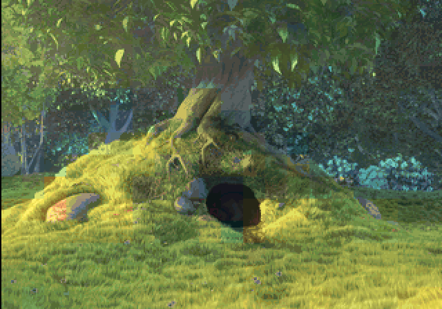
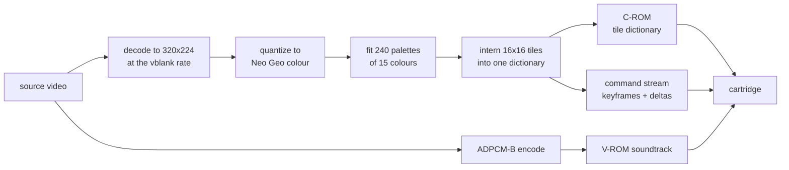
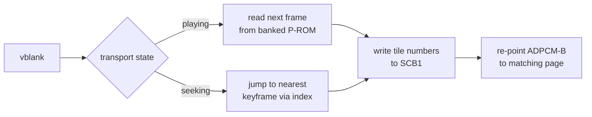

<div align="center">

# AES Movie Player

<strong>A real movie, full screen with sound, on a stock Neo Geo AES.</strong>

<br>

[](LICENSE)
[](tools/tests)
[](#on-real-hardware)
[](#hardware-ceilings)
[](#verification)

</div>

<p align="center">
  <a href="#how-it-works"><strong>How it works</strong></a> &nbsp;|&nbsp;
  <a href="#quick-start"><strong>Quick start</strong></a> &nbsp;|&nbsp;
  <a href="#verification"><strong>Verification</strong></a> &nbsp;|&nbsp;
  <a href="#what-did-not-work"><strong>What did not work</strong></a> &nbsp;|&nbsp;
  <a href="#state-of-the-work"><strong>State of the work</strong></a>
</p>

<div align="center">

**158 MB** cartridge · **35,274** frames · **59.2** fps · **846,784** tiles · **81%** of the C-ROM ceiling · **627** tests

<br>



<sub>Captured from MAME running the built cartridge, upscaled 2x with nearest neighbour. The black left column is MAME's own, and is <a href="#verification">measured and explained below</a>. The same cartridge has <a href="#on-real-hardware">played through on a real AES and MVS</a>.</sub>

</div>

---

## The problem

The Neo Geo has no video decoder, no framebuffer, and no scaler. It draws
hardware sprites and that is all. There is nowhere to put a decoded picture,
and nothing to decode it with: the 68000 runs at 12 MHz and has to hold 59.2
frames a second while the sound chip streams underneath it.

Worse, there are no residuals. A codec normally fixes a bad prediction by
adding a difference to what is already on screen. With no framebuffer there
is nothing to add to. A correction can only point a slot at some tile that
already exists.

## The solution

Do not decode on the console at all. An offline baker turns the video into
cartridge ROM images, and the on-cart player does nothing at runtime but push
pre-computed tile numbers into sprite control blocks once per vblank.

The screen is a fixed grid of 20 by 14 sprite tiles, 280 slots of 16x16
pixels covering the 320x224 raster. Every distinct tile the whole movie needs
is interned once into a global dictionary in character ROM. A frame is then
just a list of assignments: slot 137 now shows tile 90412. There is no
decompression step, because a tile number *is* the decoded form.

<table>
<tr>
<td width="50%" valign="top">

### Zero runtime decoding

The player pushes tile numbers into SCB1 and nothing else. A frame that
changes nothing costs two bytes.

</td>
<td width="50%" valign="top">

### A measured quality ladder

35 rungs, each one measured on the source rather than guessed. A rung that
costs more than its neighbour and looks no better does not appear.

</td>
</tr>
<tr>
<td width="50%" valign="top">

### Palettes refit per scene

240 CRAM banks refit per epoch and double-buffered across the hundreds of
frames an epoch lasts. About 6% less error for 1.5% more tiles.

</td>
<td width="50%" valign="top">

### Bit-exact against geolith

A frame reconstructed from the cartridge's own bytes matches what the
emulator drew, pixel for pixel, 0.0000 error.

</td>
</tr>
<tr>
<td width="50%" valign="top">

### Timing checked per instruction

Every build disassembles the player and fails on any VRAM write pair under
the documented cycle minimum. The one defect class emulators cannot show.

</td>
<td width="50%" valign="top">

### A working transport

Play, pause, fast forward at 2x, 5x and 10x, rewind, and seek, with audio
re-pointed to the matching ADPCM page on every jump.

</td>
</tr>
</table>

## How it works



At runtime the player reads the next frame's commands and writes them
straight to sprite control block 1.



**A frame that changes nothing costs two bytes.** A 24 fps source shown on a
59.185 Hz raster repeats each frame about 2.47 times, and every repeat is
free. Over ten minutes the stream averages 16.7 slot updates per frame out
of 280.

**Keyframes rewrite all 280 slots** and act as seek targets. The transport
can jump anywhere by finding the nearest keyframe in an index and replaying
from there. A ten minute movie carries 716 of them.

**There are no residuals.** Picture quality is therefore dictionary richness,
and dictionary richness is character ROM. That single fact shapes every
design decision below.

## Hardware ceilings

Read from the source of two independent emulators rather than from prose.

| Resource | Ceiling | Consequence |
|---|---|---|
| Character ROM | 20-bit tile number, 1,048,576 tiles, 128 MiB | The binding constraint at every quality tier |
| Program ROM | 3-bit bank latch, 8 banks of 1 MiB | Command stream. Used 4.5 MB across 5 banks for ten minutes |
| ADPCM-B voice ROM | 16 MiB of 4-bit samples, reached through a 16-bit page counter | About 10 minutes at the chip's 55.6 kHz ceiling. Longer sources get the highest rate that still ends on an addressable page |
| Sprites per scanline | 96 | The grid uses 20 |
| Palettes | 256 banks of 16 colours, index 0 transparent | 240 for video, 16 reserved for the menu |
| Watchdog | about 0.13 seconds | Bounds any initialisation loop |

> [!IMPORTANT]
> **There is no character-ROM bankswitching, and there cannot be.** Neither
> geolith nor MAME implements it on any board, including every bootleg mapper
> MAME carries, and the arithmetic forbids it: 2^20 tiles at 128 bytes each is
> exactly the 128 MiB the tile number addresses. 128 MiB is an absolute
> ceiling, not a window. An early design assumed 8 banks of it and was wrong.

## Quick start

### Prerequisites

| Tool | Version | Install |
|:-----|:--------|:--------|
| Python | >= 3.12 | [python.org](https://www.python.org) |
| uv | latest | [docs.astral.sh/uv](https://docs.astral.sh/uv/) |
| ffmpeg and ffprobe | any recent | [ffmpeg.org](https://ffmpeg.org) |
| m68k toolchain | ngdevkit | see [Toolchain](#toolchain) below |
| Neo Geo BIOS | any | required by the emulators only |

### Bake and build

```bash
# what could this source become?
uv --project tools run python -m aesmovie.plan --source film.mkv

# bake at the tier it picks
uv --project tools run python -m aesmovie.bake \
    --source film.mkv --start 0 --duration 596 --quality auto \
    --build-dir build --preview build/preview.mp4

# build the cartridge
bash toolchain/build-in-docker.sh
```

### Verify

```bash
bash tools/scripts/verify_mame.sh
```

The build emits a `.neo` for flash carts and emulators plus a MAME
software-list archive, and prints the spacing check on the way through:

```
CHECK VRAM write spacing
VRAM write spacing clears the 12 and 16 cycle minimums across 2 object(s)
```

`--quality` takes a tier name or `auto`. Individual flags such as
`--chroma-weight` override the tier, and the tier overrides the defaults.
`--target-fps` states a wanted frame rate instead of a hold, and the baker
refuses a hold that would drop no source frame rather than silently doing
nothing.

### Toolchain

The cartridge needs an `m68k-neogeo-elf` toolchain. Ubuntu takes it from
ngdevkit's PPA, which publishes amd64 only. Apple Silicon takes it natively
from the Homebrew tap:

```bash
brew install --force-bottle dciabrin/ngdevkit/ngdevkit-toolchain \
                            dciabrin/ngdevkit/ngdevkit
```

> [!TIP]
> `--force-bottle` is what pours the arm64 bottle on a macOS release the tap
> has not tagged yet. Without it Homebrew builds GCC from source.

[`build-in-docker.sh`](toolchain/build-in-docker.sh) compiles directly when a
toolchain is on the path and re-executes itself in a container only when one
is not, so a machine with the toolchain installed never pays for the
container. That fallback path is amd64 under emulation, because the PPA has
no arm64 build.

## The quality system

Tile cost is a property of the content, not of the running time. Dense
animation can cost several times what a dialogue scene costs, so a ladder
indexed by duration alone would over-compress easy sources and
under-compress hard ones. The baker measures the source instead.

```bash
uv --project tools run python -m aesmovie.plan --source film.mkv
```

```
Source
  film.mkv
  9:56 runtime, 1280x720, 24.00 fps, audio present

Calibration
  measured 102,271 tiles per minute at 'q09'

Quality ladder for this source
  tier      picture                                  fps     holds               verdict
  ------------------------------------------------------------------------------------
  q01       every frame, colour at 100%             59.2      7:28          over by 3:05
  ...
  q15       every frame, colour at 42%              59.2     10:46          over by 0:03
  q16       every frame, colour at 39%              59.2     11:05      fits, 0:15 spare
  q17       every frame, colour at 37%              59.2     11:25      fits, 0:34 spare
  ...
  q30       every frame, colour at 8%               59.2     19:39      fits, 8:08 spare
  q31       30 fps, colour at 8%                    29.6     21:44     fits, 10:03 spare
  q35       10 fps, colour at 8%                     9.9     43:14     fits, 29:50 spare

Selected: q17
  every frame, colour at 37%
  chroma weight 0.37, frame hold 1, tolerance 0.0026, denoise 0.0
  holds 11:25, uses 9:56, 0:34 spare

To reach 'q16' instead (every frame, colour at 39%):
  Trim 0:24, bringing the source to 9:33 or shorter.

Cartridge budget at this tier
  C-ROM    114.8 MiB of 128.0 MiB     90%   940,789 tiles
  audio     15.8 MiB of 16.0 MiB     99%   at 55.6 kHz, grade 1 of 35
```

Every tier is listed whether it fits or not, with the exact overshoot, so
trimming the source stays a decision made with the numbers in view.
Calibration takes under a minute where a bake takes hours.

The thirty-five rungs are not an arbitrary subdivision. Each one was measured,
and the ladder keeps only the settings that were not beaten on both axes at
once. That is why colour falls in uneven steps and why frame rate only starts
dropping at `q31`, once cheapening colour further has stopped buying
anything. An earlier hand-picked ladder had a rung that was strictly worse
than the one below it, which is the failure this ordering removes.

The levers, in order of how much they cost perceptually:

| Lever | What it does |
|---|---|
| Chroma weight | Scales the `a` and `b` axes of the shared Oklab metric, so colour error is charged at a fraction of the rate luma error is. Vision resolves luminance far more finely |
| Frame hold | Shows each frame for N refreshes. Only worth anything when the effective rate drops below the source rate |
| Denoise | Removes grain the dictionary would otherwise have to store |
| Redraw threshold | How far the picture may drift before a slot is rewritten |

Chroma weighting is the direct descendant of what Angel Studios did to fit
Resident Evil 2's video into 24 MiB on the Nintendo 64, quartering the
horizontal chroma resolution outright. There is no chroma plane to subsample
here, since a tile is a palette index rather than a Y/Cb/Cr triple, so the
equivalent lever is the distance metric every stage already shares. Weighting
it once moves palette fitting, tile assignment, and redraw decisions onto a
luma-first metric together.

**Calibration accuracy comes from window count, not sample length.** A
feature varies enormously in difficulty from scene to scene, so a handful of
windows lands wherever it happens to land. Measured against a known full
bake, 3 windows read 0.62 times the true rate, 6 read 1.58, and 12 read
0.91, while total sampled time barely mattered. Coverage of the content is
what converges. The default of 24 short windows lands within a percent, for
72 seconds of sampling.

<details>
<summary><strong>Per-scene palettes, rate control, and colour</strong></summary>

<br>

### Per-scene palettes

CRAM holds 240 palettes for video, and one set stretched over a whole
feature has to cover every scene in it. The baker instead cuts the movie
into epochs and refits colours for each, which measures about 6% less error
on real footage for 1.5% more tiles.

The set has to reach CRAM before the scene it belongs to appears, and a full
set is around 17,900 cycles against the 18,432 the blanking interval actually
affords, so it cannot be written in one frame alongside the picture. Epochs
therefore alternate between the two halves of the allocation: while one half
is being read, the next epoch is written into the other, a slice per frame
across the hundreds of frames an epoch lasts. Seeks and rewinds have no
run-up, so they make the target epoch resident at once.

Epochs never share dictionary entries. A tile stores palette indices rather
than colours, so one interned while a bank held one epoch's colours draws
wrong once that bank holds another's. Scenes share about 0.1% of their
tiles, so giving that up costs almost nothing.

The idea comes from libNG's `colorStream`, the library behind the Neo Geo
Bad Apple demo, which stores palette changes as forward and backward deltas
so they survive seeking and reverse playback.

Set `--palette-epoch-seconds 0` to go back to a single shared set.

### Rate control

A tier is chosen from a sample, and a sample cannot know that the third act
is busier than the first. Left alone the dictionary runs out partway through
and every remaining slot freezes, which ruins the end of a film rather than
costing a little quality across all of it.

Two mechanisms, deliberately separate:

- **The dictionary is capped at the budget.** No threshold can slow some
  content down, so the guarantee has to be structural.
- **A controller keeps the cap out of reach.** It compares the recent rate of
  tile creation against the rate the remaining budget affords, and holds a
  multiplier that ratchets up while spending runs hot and decays while it
  does not. The multiplier never falls below one, so the tier's own
  threshold is a floor and the controller can only tighten.

Correcting from cumulative overshoot was tried first and degrades like a
cliff, because overshoot sits near 1.0 for a long time and by the time the
running total is visibly over, the thresholds that would recover the deficit
are ones the formula never reaches. Measured against the tiles the content
wanted:

| Budget | Cumulative form | Integral controller |
|---|---|---|
| 100% | 7.07 | 8.50 |
| 80% | 95.32 | 11.16 |
| 60% | 117.91 | 27.80 |
| 40% | 156.93 | 45.35 |
| 25% | 286.27 | 83.46 |

The integral form also never reaches the cap at any budget, where the first
one hit it every time.

### Colour

The Neo Geo colour word is `|D0|R1|G1|B1|R5R4R3R2|G5G4G3G2|B5B4B3B2|`: five
independent bits per channel plus `D0`, a sixth bit shared across all three.
That is 15-bit colour, not the 12-bit a four-bits-per-channel reading gives.

Two digital-to-analog models exist. One scales the six-bit level linearly;
the other models the board's resistor ladder of 3900, 2200, 1000, 470 and
220 ohms per channel, which reaches true black where the linear model
bottoms out. The baker targets the resistor model, because it is the one
that models the hardware.

Distance is measured in Oklab throughout, so palette fitting, tile
assignment, redraw decisions, and the fidelity metric all agree on what
"close" means.

</details>

## Verification

Every hardware encoding this project depends on was read from emulator
source rather than documentation, and the test suite carries independent
transcriptions of geolith's tile reader and stream player used as oracles.
geolith and MAME share no code, so agreement between them is evidence about
the board rather than about one reading of the wiki.

The strongest check reconstructs a frame from the cartridge's own bytes,
replaying the command stream into a VRAM model and rendering from the packed
character ROM, then compares that against what the emulator actually drew.

On the ten minute cartridge:

| Emulator | Result |
|---|---|
| geolith | Exact. 0.0000 error, pixel for pixel |
| MAME | 1.0066 mean, 5 of 255 worst, plus column 0 |

MAME returns column 0 black across all 224 rows, which geolith's overscan
crop had been hiding. Excluding it, the residual is a smooth per-level
difference, the signature of a different digital-to-analog model rather than
a structural disagreement. Both are emulator-side.

### On real hardware

The cartridge has run on a real AES and on a real MVS, loaded from a NeoSD
flash cart. Both played the full ten minutes with no defect seen: the picture
filled the raster and stayed correct, the soundtrack played and held sync
across the whole run, and the transport responded.

That is the evidence the rest of this document could not supply. Everything
above is a reading of documentation or of an emulator, and two emulators
agreeing is weaker than it looks because both can share a tolerance the board
does not have. A board has now been the judge.

| Claim | What the run settles |
|---|---|
| Tile encoding, C-ROM packing, palette upload | The picture is correct on silicon, not only in a model of it |
| VRAM writes past the blanking interval | Permitted in practice, as the wiki says and as `OVERRUN` counts |
| ADPCM-B rate and the frame-to-page mapping | Audio holds sync across ten minutes without drifting audibly |
| 3-bit bank latch, 5 P-ROM banks, 120 palette epochs | The stream survives every bank crossing to the end of the film |
| Keyframe seek index and the audio re-point | Seek, rewind and fast forward behave as designed |

Two limits on how far to read it. The run exercises the build carrying both
of this session's timing fixes, so it says the current code is correct on a
board; it does not prove the earlier tighter spacing would have failed.
And a clean run is not a cycle measurement, so the write-spacing minimums
stay sourced from documentation and enforced by
[the build gate](#hardware-notes-worth-knowing) rather than confirmed by
observation.

## What did not work

Negative results, kept because they cost real time to find.

**Frame blending.** The error metric ranked it the strongest lever
available, cutting error from 23.33 to 9.11 at a fixed frame hold. On the
cartridge it reads as a smear and was rejected on sight. The metric scores a
blended frame as closer to the source sequence, because an average of the
surrounding frames genuinely is closer by that measure than a stale frame
is, while the eye reads the same average as an artifact. Removing it made
the picture sharper *and* the movie slightly longer, since the blend was
adding tiles.

**Motion masking.** Raising the error budget where the picture moves is
sound in a codec with residuals, and is roughly what Angel Studios did by
degrading backgrounds in busy scenes. Across factors from 20 to 3000 the
tile count here did not move by one entry while error rose fourfold. A
deferred correction still has to point at a tile, so the tile is interned
later regardless, just against a picture that has drifted further.

**A narrower raster.** Real cartridges run 304 or 288 pixels wide instead of
320, and dropping 32 columns removes a tenth of the slots, so a tenth of the
tile budget looked like it should come back. Blanking the outer 16 pixels on
each side of a 40 second window moved the tile count from 35,136 to 35,779:
it went *up*. Blanking the same 32 pixels down the middle instead took it to
30,098. The same area is worth 14% of the dictionary in the centre and less
than nothing at the edges, because cost follows novel detail and framing puts
the detail in the middle. A narrower raster buys a smaller picture and no
budget, so width stays at 320.

**Flip deduplication.** 67 saved tiles out of 81,044. Exact 16x16 mirrors
essentially do not occur in photographed or rendered material.

**Compressing the command stream, and auto-animation.** Both save stream
bytes. The stream used 3.0 MB of 8 MiB, so stream bytes are not scarce.

**Palette-only fades.** Across a whole movie, 35.7% of frames change at all
and only 4.6% of those are explained by a single global brightness scale.

**Sprite-position motion compensation.** The grid tiles the raster, so
moving a sprite shifts a whole 16 pixel column, and content almost never
pans by exactly one tile.

**Near-duplicate merging in the dictionary.** The obvious attack on the
binding constraint, and it does not pay. At thresholds fine enough to be
imperceptible it collapses 1 to 3% of the dictionary; only signatures coarse
enough to visibly destroy detail reach 48%. Tiles genuinely differ.

**Dithering the source before quantisation.** No measurable effect, because
the banding comes from the 15 colours a tile may use rather than from the
15-bit colour word. Dithering inside palette assignment would be the real
lever and has not been built.

Two measurement traps also worth recording. Counting the *number* of slots
that differ is useless as a scene-cut test on photographed material, where
grain perturbs nearly every slot every frame: it fired on 22% of all frames,
and each false cut rewrote all 280 slots. And a metric that averages the
error of tiles the encoder *wrote* improves whenever the encoder skips more
work, so it rewards doing less; the fidelity number here charges every slot
of every frame against the true source frame instead.

## Hardware notes worth knowing

The address port sits at 0x3C0000 and the data port immediately after it, so
a single 32-bit write lands both, and every scattered VRAM write costs one
instruction instead of two. Runs still stream through the auto-increment
port, where one write per word is already the floor.

The fix layer has 32 rows but the raster only shows rows 2 to 29, so an
overlay anchored to row 27 floats two rows above the bottom edge.

<details>
<summary><strong>Checked against documentation rather than against an emulator</strong></summary>

<br>

Two emulators agreeing is weaker evidence than it looks: both can share a
tolerance the hardware does not have. These points come from the NeoGeo
Development Wiki's VRAM page.

| Claim | Status |
|---|---|
| Address port `$3C0000`, data `$3C0002`, modulo `$3C0004`, signed auto-increment after write | Confirmed |
| Writing VRAM during active display | **Permitted.** "VRAM can be modified even during active display", so frames that overrun vblank are not a hardware fault |
| At least 12 CPU cycles between consecutive data writes, >24 mclk | **Verified on every build.** The tightest pair leaves 20 |
| At least 16 CPU cycles after a write before setting a new address | **Verified on every build.** The tightest pair leaves 20 |
| At least 16 CPU cycles after setting an address before a read | Not applicable. The player never reads VRAM |
| Bit 15 of `$3C0006` low means vblank | **Wrong.** The read is a raster line counter, and bit 15 is low for 8 scanlines out of 264 |

The cycle spacing was the live risk. `apply_frame` writes back to back:

```c
while (tiles--) {
    REG_VRAMRW = *cursor++;
    REG_VRAMRW = *cursor++;
}
```

The worry was `move.w (An)+,(An)`, which costs 12 cycles and sits exactly on
the documented minimum with no margin. GCC emits something else:

```
226:  moveal #3932162,%a1     12
22c:  movew  %a0@,%a1@        12   data write
22e:  addql  #4,%a0            8
230:  movew  %a0@(-2),%a1@    16   data write
234:  cmpl   %a0,%d0           6
236:  bnes   226              10
```

Twenty cycles separate the two writes, the loop's back edge puts 36 between
the second write and the first of the next tile, and leaving the loop for the
next run's address write costs 88. Both minimums clear with margin, so
`apply_frame` needs no change. The compiler reloads the port address every
iteration, which wastes 12 cycles per tile and happens to widen the gap.

The same walk covers every other VRAM write in the player: the two
`clear_vram` fills, the sprite grid, and the whole fix-layer overlay. One
pair failed it. `draw_seek_bar` drew the bar's right cap and then the knob,
and the compiler hoisted the knob's operands above the loop, so the two
`vram_poke` calls came out back to back with 12 cycles between the cap's data
write and the knob's address write, where 16 are required. Folding the knob
into the loop as one more tile choice drops the trailing write entirely and
costs one cell fewer to draw. The tightest pair anywhere is now 20 cycles.

Nothing in the C source holds that result, because C cannot express
instruction spacing. A check holds it instead.
[`check_vram_timing.py`](tools/scripts/check_vram_timing.py) walks the
compiled objects, models each write as its bus cycles rather than as an
instruction, follows branches across the whole reachable window, and fails on
any pair under the floor. It reported this defect before the fix and passes
after it, and it runs right after the compile step in
[`build-in-docker.sh`](toolchain/build-in-docker.sh) so a future compiler
cannot quietly undo the result.

None of this needs a container. The toolchain installs natively on Apple
Silicon from ngdevkit's Homebrew tap, and the objects it produces are
byte-identical to the ones the container built.

</details>

<details>
<summary><strong>The vblank bit is a line counter, and the player only gets its tail</strong></summary>

<br>

The last unverified row above did not survive a source read. `$3C0006` on
read is a raster line counter rather than a flag. geolith builds it as
`((scanline + 0xf8) << 7) | aa_counter`; MAME builds it as `(v_counter << 7)`
over a chain its own comment describes as going "from 0xf8 - 0x1ff". Two
codebases sharing nothing produce the same register, and the wiki's register
table agrees, calling it the raster line counter.

Bit 15 is bit 8 of that counter. It is low for counter values `0xF8` to
`0xFF` and high for `0x100` to `0x1FF`, so it marks 8 scanlines out of 264,
not a blanking interval.

`wait_vblank` waits for the edge into those 8 lines. It does synchronise once
per frame, which is why the player runs correctly, but it does not hand the
frame a blanking interval to work in. It returns with 8 scanlines left before
geolith resumes drawing, 6,144 cycles at 768 cycles a line, and 24 before
MAME's visible region starts. A keyframe rewriting all 280 slots costs
roughly 18,000 cycles on the loop measured above, so it runs past that point
every time. The hardware permits the overrun, per the row above, and this is
what `OVERRUN` counts. It is not counting lost frames, which is why the frame
counters stayed flat while it reported 20%.

The counter reads out whole in bits 15 to 7, so the start of the interval is
available without knowing anything new about the board. `wait_vblank` now
waits for that edge instead, which hands each frame all 24 blanking lines
rather than the last 8. Measured under MAME on the same cartridge, 60
emulated seconds each, reading the player's own counters:

| Sync point | Frames | Overruns | Rate |
|---|---|---|---|
| Bit 15, the last 8 lines | 2,743 | 631 | 23.0% |
| Start of blanking | 2,743 | 64 | 2.3% |

The frame count is identical, so nothing was gained or lost in the trade. The
23% also matches the 20% the diagnostics build reported before any of this,
which is the check that the two measurements are of the same thing.

</details>

<details>
<summary><strong>Encodings read from the decoders, not guessed</strong></summary>

<br>

Every bit layout below was read out of an emulator's source rather than from
a prose summary. Where geolith and MAME agree, they are two implementations
sharing no code, which is the strongest evidence available without a board.

Sources: [geolith-libretro](https://github.com/libretro/geolith-libretro)
`src/geo_lspc.c`, and [mamedev/mame](https://github.com/mamedev/mame)
`src/mame/snk/neogeo_spr.cpp`, `neogeo.cpp`, `src/devices/bus/neogeo/slot.cpp`.

| Encoding | Value |
|---|---|
| SCB1 tile number | `even_word \| ((odd_word & 0x00F0) << 12)`, 20 bits |
| SCB1 palette | odd bits 15 to 8 |
| SCB1 hflip / vflip | odd bit 0 / odd bit 1 |
| SCB1 auto-animation | odd bits 3 to 2 |
| SCB3 | bit 6 sticky, bits 15 to 7 are `512 - top`, bits 5 to 0 height in tiles |
| Sprite loop | `for i = 1; i < 382`, so sprite 0 never draws |
| Tile bytes | 128 bytes, byte-interleaved c1 and c2, columns 8 to 15 first, four bytes per row, bit `n` is column `n`, leftmost pixel is the least significant bit |
| Colour word | `\|D0\|R1\|G1\|B1\|R5R4R3R2\|G5G4G3G2\|B5B4B3B2\|`, five bits per channel plus a shared sixth, so 15-bit colour |
| ADPCM-B rate | `f = 55555 * DeltaN / 65535`, 1.85 kHz to 55.5 kHz |
| ADPCM-B ROM | 16 MiB, one continuous loopable sample |
| MAME voice dataarea | `ymsnd:adpcmb` |
| Watchdog | about 0.13 s, roughly 7.7 frames |

Two digital-to-analog models exist in geolith. `geo_lspc_palgen_raw` scales
the six-bit level linearly; `geo_lspc_palgen_resnet` models the board's
resistor ladder of 3900, 2200, 1000, 470 and 220 ohms per channel and
reaches true black where the raw model bottoms out at 4. The resistor model
is the hardware-accurate one, so the baker targets it.

The libretro front end crops by `geolith_overscan_*`, eight pixels a side by
default, so a capture shows 304 of the 320 active columns unless zeroed.

### Where the emulators disagree, and who wins

- **Program-ROM banking.** MAME masks the bank register with `0x07`, giving
  8 banks of 1 MiB, which matches the three-bit latch on the board. geolith
  derives its mask from the ROM size and allows up to 8 bits. A stream
  needing more than 8 banks works in geolith and reads the wrong bank on
  hardware, so the baker enforces MAME's limit.
- **C-ROM banking does not exist**, as the ceilings table above records.
  Both emulators agree by omission: neither implements it on any board.

</details>

<details>
<summary><strong>Prior art the design draws on</strong></summary>

<br>

- **Resident Evil 2 on the Nintendo 64.** Angel Studios fit a two-CD, 1.2 GB
  game into 64 MiB with 15 minutes of video in a 24 MiB budget, a 165:1
  ratio, decoded in software with no video hardware. Chroma subsampling is
  the technique this project inherits, as the chroma weight on the shared
  Oklab metric.
  [Modern Vintage Gamer](https://www.youtube.com/watch?v=BaX5YUZ5FLk),
  [Hackaday](https://hackaday.com/2026/02/03/how-resident-evil-2-for-the-n64-kept-its-fmv-cutscenes/),
  [Angel Studios postmortem](https://www.gamedeveloper.com/programming/postmortem-angel-studios-i-resident-evil-2-i-n64-version-)
- **RoQ**, used by The 11th Hour and Quake III: a motion-compensating vector
  quantizer with per-frame codebooks capped at 256 entries, so a bounded
  number of new fragments enter per frame. This is the shape of the baker's
  tile dictionary with a per-frame cap.
  [MultimediaWiki](https://wiki.multimedia.cx/index.php/RoQ)
- **Bad Apple on the Neo Geo** by HPMAN: 320x224, 13,167 frames, about four
  minutes in roughly 3 MB. One bit and one palette, so tile dedup is
  best-case, but it proves tile-streamed video with synced audio on real
  hardware. [yAronet](https://www.yaronet.com/topics/188010-bad-apple-demo-datlibdatimageneosoundbuilder)

</details>

## State of the work

A single place to answer "where is this" without reading the history.

### It plays on a board

The build carrying both of this session's timing fixes has run from a NeoSD
flash cart on a real AES and a real MVS, full length, with no defect seen.
That closes the question the project could not answer for its whole life, and
it is written up with its limits under
[On real hardware](#on-real-hardware).

### The cartridge on disk

Baked from `assets/clip/big_buck_bunny_720p_h264.mov`, full length, with
every parameter measured from the source rather than fixed.

| Quantity | Value |
|---|---|
| Tier | `Q17`, colour at 37% |
| Frames | 35,274, 59.2 fps, no holds |
| C-ROM | 846,784 tiles, 81% of 128 MiB |
| Palette epochs | 120, cadence from 6.0 measured cuts per minute |
| Scene cut floor | 0.01175, the source's own 99th percentile |
| Palette sampling | every 7 frames, derived from the epoch |
| Audio | 55,555 Hz, the chip's ceiling |
| Displayed error | 0.001006 |

The overlay font covers upper and lower case, digits and punctuation: 83
glyphs drawn as text art, 2,656 bytes of the 128 KiB S-ROM. Lowercase was
appended after the existing glyphs, so every tile index the player and the
baked subtitle records already used is unchanged, and a subtitle now keeps
the case it was written in rather than folding to capitals.

### Audio and video are locked

Read off the player's own diagnostics page, which is the only measurement
here that proved trustworthy.

| Build | Vblank | Player frame | Behind |
|---|---|---|---|
| Shipped | 1,800 | 1,792 | 8 |
| Shipped | 12,000 | 11,991 | 9 |
| Diagnostics | 35,000 | 34,983 | 17 |

The offset is flat across the whole movie, so it is the cost of booting
before the movie starts rather than drift. The diagnostics build reads 17
because it draws an extra row of text every frame. Audio starts immediately
after frame 0 is applied and the YM2610 then streams on its own from the
same crystal as the raster, so there is no mechanism left to separate them.
`OVERRUN` reached 20% of frames on those builds and 2.3% once `wait_vblank`
was moved to the start of the blanking interval. Neither figure costs a
frame, and per the section above the hardware permits the writes either way.

Residual error: 3 ms from the ADPCM rate grid across ten minutes, 3 ms from
the frame-to-page mapping, and up to 4.6 ms rounding on each seek.

The cartridge on disk was rebuilt after the seek-bar fix. Only the overlay
changed: `main.o` disassembles identically to the build the emulator
comparison above was run against, so the video path is the same bytes and
that comparison still stands. The overlay has since been exercised on both
emulators and on the two boards, drawing the transport panel, the seek bar
and the diagnostics page without a defect.

<details>
<summary><strong><code>measure_drift.py</code> now refuses the answers it used to invent</strong></summary>

<br>

It reported the player 662 frames behind once and 720 behind another time;
the counters showed 8 and 17. The cause was not a coding bug but the method.
The tool takes the frame whose reconstruction is closest to the capture, and
over a wide window a feature contains frames that resemble each other more
than the emulator's own residual separates them. Argmin then lands on a
distant frame and reports it with no less confidence than a true match. Both
bad readings came from runs with a window wide enough to reach that far,
which is also why it looked reliable at shallow depths.

It now scores every candidate, finds the best match, sets aside the run of
pixel-identical frames around it, and looks at the closest rival outside that
run. When the rival is within `--min-separation` of the best, default 1.0 of
255, the scan prints both and returns nothing rather than choosing. A guess
that announces itself as a guess is the part that was missing.

The on-screen counters remain the better instrument, and they are what the
measurements above were read from: build with `debug_visible = 1` and
capture.

</details>

### What is left

1. **Gradient blocking.** Visible on flat areas such as the closing card.
   Dithering the source before quantisation was tried and does nothing,
   because the banding comes from the fifteen colours a tile may use rather
   than from the colour word. Dithering where pixels are matched to a palette
   is the untried version, and the dictionary rules out the obvious form of
   it. Error diffusion makes a tile's output depend on its neighbours, so two
   identical source tiles stop quantising alike and stop interning as one,
   which spends the C-ROM the whole design is short of. An ordered threshold
   whose period divides 16 has neither problem: it depends only on where a
   pixel sits inside its own tile, and it still runs continuously across tile
   boundaries. It fits the existing lookup as a second-nearest entry and a
   blend fraction beside the nearest one already precomputed per palette and
   colour. Whether it beats the banding is a question for a person and a full
   bake, since the metric already proved it ranks smearing highest.
2. **A tier above `q17`.** The ladder runs up to `q01` and the bake stops at
   `q17` because that is the highest rung fitting 9:56 untrimmed. `q16`
   needs about 24 seconds trimmed. Each step is a fresh 40 minute bake and
   the trim is an editorial decision, so it waits for a call rather than a
   measurement.

### Standing rules for this project

Requests that outlive any single change.

- **Nothing hardcoded that the source can decide.** Hardware limits are
  fixed; anything else is measured. The audit of which is which is under
  [The quality system](#the-quality-system), and the values the current bake
  derived are in the table above.
- **Extract the maximum quality the hardware allows,** losing only what a
  viewer cannot perceive. Every lever that was tried and failed is under
  [What did not work](#what-did-not-work), so it is not tried twice.
- **Give the decision to the operator.** The plan prints every rung with its
  exact overshoot so trimming stays a choice made with numbers in view.
- **Motion blur stays out.** Revisiting it was considered and declined. It
  cannot help the blocking, which has spatial causes, and blending at full
  frame rate reads as a smear. The only defensible case would be shutter
  blending at `frame_hold > 1`, which no current bake uses.
- **Judge picture quality by eye, not by the metric.** `displayed_error`
  ranked frame blending the strongest lever available and it looked awful on
  the cartridge. Numbers decide cost; a person decides quality.
- **Verify deep frames from the on-screen counters.** See the warning about
  `measure_drift.py` above. Reporting a regression that a stale capture
  invented happened twice in one session.

## FAQ

<details>
<summary><strong>Why not just use a video codec?</strong></summary>
<br>

There is nothing to run it on. The console has no video decoder and no
framebuffer, and the 68000 at 12 MHz has roughly 18,000 cycles of blanking
per frame, which is about what rewriting the screen once already costs. Every
codec technique that assumes a residual path fails here, because a correction
cannot nudge a pixel. It can only point a slot at a tile that already exists.

</details>

<details>
<summary><strong>Has this run on a real AES?</strong></summary>
<br>

Yes, and on a real MVS, from a NeoSD flash cart. Both played the full ten
minutes with the picture correct, the sound in sync and the transport
working, with no defect seen. The details and the limits of what that
settles are under [On real hardware](#on-real-hardware).

The care taken before that run still stands behind the rest of the document:
every hardware claim here comes from documentation or from emulator source,
never from two emulators agreeing, because both can share a tolerance the
board does not have. The instruction-level timing check exists for the same
reason, and a clean playthrough is not a substitute for it since it measures
no cycles.

</details>

<details>
<summary><strong>How long does a bake take?</strong></summary>
<br>

Hours for a full feature. Calibration takes under a minute, which is why
[the quality system](#the-quality-system) measures the source first and
prints every rung with its exact overshoot before anything commits to a bake.

</details>

<details>
<summary><strong>Can I use my own movie?</strong></summary>
<br>

Yes. Point `--source` at any file ffmpeg reads. The plan step measures it and
picks a tier; how much runtime fits depends entirely on how much novel detail
the content carries, not on its length alone. Audio caps at about 10 minutes
at the chip's 55.6 kHz ceiling, and longer sources get the highest rate that
still ends on an addressable page.

</details>

<details>
<summary><strong>Why is the picture 320 pixels wide when real cartridges use 304?</strong></summary>
<br>

Because narrowing it costs tiles instead of saving them. Blanking 16 pixels
on each side of a test window moved the tile count *up*, from 35,136 to
35,779, while blanking the same 32 pixels down the middle took it to 30,098.
Cost follows novel detail, and framing puts the detail in the middle. The
full measurement is under [What did not work](#what-did-not-work).

</details>

## Repository layout

| Path | Contents |
|---|---|
| [`src/`](src) | The 68000 player, the fix-layer menu, and the Z80 sound driver |
| [`tools/aesmovie/`](tools/aesmovie) | The baker: decode, colour, palettes, dictionary, encoder, quality ladder, audio, ROM containers |
| [`tools/tests/`](tools/tests) | Test suite, including the emulator transcriptions used as oracles |
| [`tools/scripts/`](tools/scripts) | Capture, verification, and timing helpers |
| [`toolchain/`](toolchain) | The ngdevkit build, native or containerised |

## Licence

GPL-3.0. See [`LICENSE`](LICENSE).

## Credits

Built with [ngdevkit](https://github.com/dciabrin/ngdevkit). Verified
against [geolith](https://github.com/libretro/geolith-libretro) and
[MAME](https://github.com/mamedev/mame). Test footage is Big Buck Bunny and
Tears of Steel, both by the Blender Foundation under CC BY.
