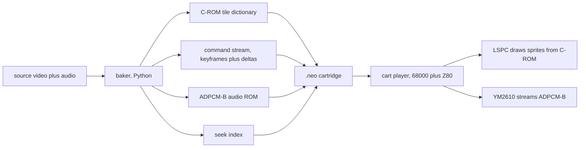

# AES Movie Player: Active Plan (Single Source of Truth)

An offline baker that turns a video file into a Neo Geo AES cartridge ROM, plus a small on-cart player with full transport controls. All heavy processing happens offline in Python bakers. The console decodes nothing at runtime: it streams pre-baked hardware-sprite tile-number updates to the LSPC, plays a pre-encoded ADPCM-B soundtrack, and drives a menu. This file is the SSOT. Research findings with citations live beside it in `references.md`.

## Vision

Play a real movie on a stock Neo Geo AES, full screen, full color, with mono audio and a proper transport UI: play, pause, fast-forward at 2x, 5x, and 10x, rewind, and seek forward and back. Quality is the priority; cart size is not a constraint per the DoomNG standing rule that the cart grows freely. The only hard ceilings are the ones the hardware imposes on addressing, catalogued below.

## Locked targets

| Target | Value | Reason |
|--------|-------|--------|
| Resolution | 320x224, the 240p native raster | Native LSPC active area, no scaling |
| Framerate | Locked to vblank, about 59.185 fps | One movie frame per refresh, even cadence, trivial sync |
| Audio | Mono, ADPCM-B streamed | Single continuous multi-minute sample, hardware-native |
| Transport | play, pause, 2x, 5x, 10x, rewind, seek | Requires random access, so a keyframe-plus-delta codec |

## Hard hardware ceilings

These come from the research pass and bound the design. See `references.md` for citations.

| Resource | Ceiling | Consequence |
|----------|---------|-------------|
| C-ROM tile number | 20 bits, 1,048,576 tiles, 128 MiB per bank window | The video tile dictionary caps at 128 MiB unless C-ROM is bankswitched |
| C-ROM banks | 8 banks supported, used by Giga Power carts | Bankswitching at segment boundaries extends total video beyond 128 MiB |
| Sprite tile | 16x16, 4bpp, 128 bytes, 15 colors plus transparent index 0 | The dictionary unit is a 16x16 tile at 128 bytes |
| ADPCM-B ROM | 16 MiB, one continuous loopable sample | About 25 minutes of audio at 22 kHz, never the limiting factor |
| ADPCM-B rate | 1.85 to 55.5 kHz via Delta-N | Pick around 22 to 32 kHz mono for a good soundtrack |
| Per-scanline sprites | 96 | A 20-column full-screen grid uses 20, far under the limit |
| Total sprites | 381 | 20 for the video grid leaves room for foreground layers |

The single dominant constraint on video is the 128 MiB C-ROM window. Worst case, every one of the 280 on-screen tiles is unique every frame, so a frame costs 280 x 128 = 35,840 bytes and 128 MiB holds about 3,745 frames, roughly 63 seconds at full framerate. Every technique below exists to beat that worst case by a large multiple, and C-ROM bankswitching lifts the ceiling for longer runtimes.

## Architecture

Two halves. The baker is where all intelligence lives. The player is deliberately small.

### The codec: tile-dictionary VQ with keyframes and deltas

Modeled on RoQ, a motion-compensating vector quantizer, adapted so the C-ROM is the codebook and the LSPC is the decoder.

- **Dictionary.** Every unique 16x16 tile the movie needs, deduplicated globally, stored once in C-ROM. A tile recurring anywhere in space or time is free after the first. Referenced by 20-bit tile number.
- **Keyframes, the I-frames.** Every K frames, and on every scene cut, a full frame: all 280 tile slots rewritten. Keyframes are the random-access entry points that make the transport controls possible. K around 30 to 60, so a seek replays at most half a second to a second of deltas.
- **Deltas, the P-frames.** Between keyframes, only the tile slots that changed. Each delta entry is a slot index plus a 20-bit tile number, run-length coded when changes are contiguous.
- **Command stream.** The ordered list of keyframes and deltas, read by the 68000. Because the 68000 reads it and sits near idle, this stream, unlike the tiles, can be entropy or LZ compressed and decoded at runtime.
- **Seek index.** A small table mapping movie time to the byte offset of each keyframe in the command stream, and to the matching ADPCM-B start address, so a seek re-points both video and audio.

### Data-saving techniques, ranked by impact

All stack multiplicatively. The baker applies them as encoder passes.

1. **Global tile dedup with a tolerance knob.** The foundation. Near-identical tiles collapse within a perceptual distance. The main quality-versus-size control.
2. **Temporal deltas.** Only changed slots per frame. Static regions cost nothing.
3. **Sprite-position motion, the biggest hardware win.** A pan or a translating object moves the sprite X and Y instead of re-tiling. Panning shots become nearly free. This is motion compensation done by the position registers.
4. **Palette-only effects.** Fades, cross-fades, flashes, and tinting change CRAM, not tiles. A fade to black is a handful of color writes and zero tile data.
5. **Flip dedup.** Per-tile hflip and vflip mean a tile and its mirror share one entry. Roughly 2x on symmetric content.
6. **Foreground over background layering.** Static background on low sprite slots, small moving elements on high slots. A talking head streams only the mouth region.
7. **Auto-animation.** Looping motion like fire or a spinning logo uses the hardware 2, 4, or 8 frame auto-cycle at zero per-frame cost.
8. **Compressed command stream.** Entropy or LZ on the delta lists, decoded by the 68000.
9. **Denoise and temporal-stability preprocessing.** Denoise the source first, because noise makes every tile change and destroys deltas. Bias quantization toward reusing the previous frame's tile.
10. **Motion-adaptive keyframe spacing.** More keyframes across cuts and motion, fewer during static shots.

### The honest limit

There is no framebuffer, so there are no additive residuals. Every change resolves to pointing a slot at a tile that already exists in the dictionary, possibly flipped, with some palette. When the needed tile is absent, the only fix is to add it, at C-ROM cost. Residual precision equals dictionary richness equals C-ROM. Complex motion will look quantized, in the Sega CD and 3DO FMV grade, full screen and richly colored but visibly tiled on busy motion. That is the accepted quality target.

## Color

- Quantize each frame to a set of 16-color palettes drawn from the 256 CRAM banks, up to 4096 on-screen colors. Per-tile palette assignment picks the best bank per 16x16 tile.
- Reuse the DoomNG `sprite_palette.py` clustering and `palette.py` `rgb_to_neogeo` and OKLab distance. Reference the tiled-palette-quantizer approach for optimal per-tile assignment.
- Dither in a way that survives tile dedup: prefer ordered dithering keyed to tile position so identical content dithers identically and still dedups, rather than error diffusion that makes every tile unique.
- Keep palettes temporally stable so palette-only fades and cross-fades stay cheap.

## Audio

- One continuous ADPCM-B sample, mono, target 22 to 32 kHz, encoded offline from the soundtrack, up to 16 MiB, about 25 minutes at 22 kHz.
- The YM2610 plays it autonomously. The Z80 driver starts, stops, and re-points the ADPCM-B start address on seek. Video advances one frame per vblank, and the seek index keeps audio and video aligned.
- Trick modes: mute audio during fast-forward and rewind, resume and resync on play. ADPCM-B start address is settable to any 256-byte-aligned point, so seek re-points audio cleanly.
- This path is net-new. DoomNG uses a nullsound placeholder and only an ADPCM-A dataarea, so the ADPCM-B encoder and the Z80 streaming driver are the main new components. Confirm the MAME and neosdconv region naming for delta-t against a working ADPCM-B homebrew first.

## Player and menu

The cart runtime is a small state machine on the 68000, plus the Z80 audio driver.

- **Per vblank:** read the current command-stream position, apply the keyframe or delta by writing SCB tile numbers, advance by the transport state.
- **Transport states:** play advances one frame per vblank; pause holds; 2x, 5x, 10x advance by stepping through keyframes and decimated frames so trick play stays smooth without decoding every intermediate; rewind seeks backward keyframe to keyframe and steps forward in short bursts; seek jumps to the nearest keyframe at or before the target and replays deltas to it.
- **Menu UI:** drawn on the fix layer over the video, an overlay with the transport icons and a scrubber. Controller input drives it. This reuses the DoomNG fix-layer HUD pattern in `i_video.c` and `hud_fix.py`.
- **Sync:** the seek index binds every keyframe to an ADPCM-B start address, so any jump re-points audio and video together.

## Reuse from DoomNG

| Component | Source | Use |
|-----------|--------|-----|
| C-ROM tile packer | `tools/doomng_build/bake/crom.py`, `pack_bitmap_to_tiles`, column-major | Pack dictionary tiles, unchanged |
| Palette conversion | `palette.py`, `rgb_to_neogeo`, `oklab_distance_sq` | Color to Neo Geo, perceptual distance |
| Palette clustering | `sprite_palette.py`, `cluster_sprite_palettes`, `histogram_sprite_pixels` | Per-tile 16-color palette assignment |
| Tile allocation | `sprite_atlas_allocator.py` | Assign dictionary tile bases |
| ngdevkit build and .neo packaging | `toolchain/build-in-docker.sh`, neosdconv, MAME dataarea XML | Adapt for a large C-ROM plus ADPCM-B cart |
| SCB hardware reference | `vendor/ngrayex/hw.h` | SCB1 to SCB4 layout, hshrink, vshrink, auto-increment |
| Docker build resilience | `build-in-docker.sh` retry wrapper | Same flaky-toolchain mitigation |

Net-new: the video encoder passes, the delta and keyframe command-stream format, the seek index, the ADPCM-B encoder, the Z80 streaming driver, the on-cart player and menu, and C-ROM bankswitching support in the packaging.

## Confirmed hardware encodings

Resolved on 2026-08-02 by reading the geolith LSPC implementation, the emulator this project verifies against, so these are the encodings the target decoder actually applies. Citations in `references.md`. They close the SCB and color caveats that were open at design time.

### SCB1 tile entry, two words per tile

| Field | Location |
|-------|----------|
| Tile number bits 15 to 0 | even word |
| Tile number bits 19 to 16 | odd word bits 7 to 4 |
| Horizontal flip | odd word bit 0 |
| Vertical flip | odd word bit 1 |
| Auto-animation | odd word bits 3 to 2, `01` is 4 tiles, `1x` is 8 tiles |
| Palette | odd word bits 15 to 8 |

So the attribute word is `(palette << 8) | (tile_hi << 4) | (aa << 2) | (vflip << 1) | hflip`.

### Sprite geometry

| Register | Encoding |
|----------|----------|
| SCB2 at `0x8000 + n` | vshrink in bits 7 to 0, `0xFF` full. hshrink in bits 11 to 8, `0x0F` full |
| SCB3 at `0x8200 + n` | Y in bits 15 to 7 as `496 - top` for a visible-area origin. Sticky in bit 6. Height in tiles in bits 5 to 0 |
| SCB4 at `0x8400 + n` | X in bits 15 to 7 |

Sticky chains a sprite to the previous one, advancing X by `hshrink + 1`, which is 16 at full width, and inheriting Y and height. Sprite index 0 is never drawn, so the video grid occupies sprites 1 to 20.

### Color

The palette word is `|D0|R1|G1|B1|R5R4R3R2|G5G4G3G2|B5B4B3B2|`. Each channel is 5 independent bits plus `D0`, a sixth bit shared across all three channels, so the per-channel 6-bit level is `2 * c5 + (1 - D0)` and the displayed 8-bit value is `(level * 259 + 33) >> 6`. The baker fixes `D0` to 0 and uses 32 levels per channel, which caps quantization error near 1.6 percent, far below the error the 15-colors-per-tile constraint imposes. Index 0 of every sprite palette is transparent, so a palette carries 15 usable colors.

This supersedes the 4-bit-per-channel `rgb_to_neogeo` in the DoomNG `palette.py`, which discards the three low bits. Video quality needs the full 15-bit color, so the color model is adapted rather than reused.

## Spike layout

The spike bakes 425 to 445 seconds of Big Buck Bunny, 720p 24 fps, chosen by a whole-movie motion scan for the widest motion range available in a 20 second window: near-static at one end, cuts and fast action at the other. Clip content is CC-BY Blender Foundation and is not committed.

The baker lives under `tools/`, the cart under `src/`, and every generated artifact under `build/`.

| Path | Role |
|------|------|
| `tools/pyproject.toml` | uv project for the baker |
| `tools/aesmovie/neocolor.py` | Neo Geo color model, OKLab distance |
| `tools/aesmovie/frames.py` | ffmpeg decode, crop, scale, vblank-rate resample |
| `tools/aesmovie/palettes.py` | per-tile palette clustering and assignment |
| `tools/aesmovie/crom.py` | 16x16 tile packer, adapted from DoomNG |
| `tools/aesmovie/dictionary.py` | global tile dedup including flips |
| `tools/aesmovie/stream.py` | keyframe and delta command stream, seek index |
| `tools/aesmovie/encode.py` | per-frame slot loop, temporal tolerance, keyframe cadence |
| `tools/aesmovie/bake.py` | CLI that drives the passes and reports sizes |
| `tools/tests/` | unit tests for the pure encoders |
| `src/hw.h` | LSPC, CRAM, and SCB helpers |
| `src/main.c` | vblank-driven player and transport state machine |
| `src/menu.h` | fix-layer overlay interface |
| `src/menu.c` | fix-layer transport overlay, auto-hiding |
| `tools/aesmovie/fixtiles.py` | generates the S-ROM glyphs the overlay draws with |
| `tools/aesmovie/neofile.py` | streams the .neo cart container, replacing neosdconv |
| `tools/aesmovie/adpcmb.py` | mono ADPCM-B encoder for the YM2610 voice ROM |
| `src/sound.s` | Z80 driver that starts and loops the ADPCM-B soundtrack |
| `src/movie_data.S` | links the baked blobs into the ROM |
| `toolchain/build-in-docker.sh` | ngdevkit build and .neo packaging |
| `tools/scripts/capture_rom.sh` | headless geolith capture |
| `tools/scripts/verify_capture.py` | matches a geolith capture against the baker's own render |
| `NEXT_SESSION.md` | handoff, derived from this plan |

### Spike simplifications

Named so they are not mistaken for the final design.

- Framing fills the screen by center-cropping to 320x224 rather than letterboxing. Full screen is the stated goal, and black bars would inflate the dedup rate and flatter the C-ROM measurement.
- One global palette set for the whole clip, 240 palettes at CRAM banks 16 to 255, leaving banks 0 to 15 for the fix-layer menu. Per-keyframe palette sets come later.
- The command stream is uncompressed and lives in P-ROM as a linked blob, which holds for 20 seconds but not for a feature runtime.
- Audio is deferred to M2. The spike answers the two questions that need real footage, dictionary size and quantization in motion, and both are video questions.

## Spike measurements, 2026-08-02

Twenty seconds of Big Buck Bunny at 425 to 445 seconds, 1183 frames at the vblank rate, full-screen center crop, 240 palettes, keyframe interval 90, scene-cut ratio 0.90, tolerance 0.0005, flip dedup on.

| Measure | Value |
|---------|-------|
| Unique tiles | 77,743 of the 1,048,576 the 20-bit tile number addresses |
| C-ROM payload | 9.49 MiB, padded to 16 MiB across the c1 and c2 pair |
| Command stream | 353 KiB, of which 242 KiB is keyframes and 111 KiB deltas |
| Seek index | 4.6 KiB |
| Keyframes | 206 |
| Slot updates per frame | 67.5 mean, 280 peak |
| Mean quantization error | 6.3e-4 squared Oklab, about 0.025 Oklab per pixel |
| P-ROM used | 386,736 bytes of the 524,288 byte window |

### What the numbers mean

**C-ROM costs about 30 MB per minute on this content, so one 128 MiB bank holds 4.5 minutes and the 8 banks hold roughly 36 minutes.** The design-time worst case was 63 seconds per bank, so the encoder passes bought about 4.3x. A feature runtime does not fit. A 30 minute program does.

**The command stream is a second constraint the design did not account for.** At 1.08 MB per minute, one C-ROM bank's worth of video needs 4.9 MB of stream, and the P-ROM window is 1 MiB. The stream needs its own banking or compression scheme before any runtime past about 8 minutes. This gates M3 more than the transport controls do.

**The 20-bit tile number is not the binding limit.** 128 MiB divided by the 128 byte tile is exactly 1,048,576 tiles, so the addressing ceiling and the size ceiling are the same wall, and size is what we hit.

### Lever sweep

Measured on the same 20 seconds, one lever at a time against `scene-cut 0.90`.

| Variant | Tiles | C-ROM MiB | Stream KiB | Mean error x1e4 |
|---------|-------|-----------|------------|-----------------|
| Baseline, scene-cut 0.55, no tolerance | 98,884 | 12.07 | 473 | 4.56 |
| scene-cut 0.90 | 98,884 | 12.07 | 462 | 4.81 |
| tolerance 0.0002 | 84,090 | 10.26 | 386 | 5.75 |
| tolerance 0.0005 | 80,977 | 9.88 | 371 | 5.92 |
| tolerance 0.0010 | 77,707 | 9.49 | 355 | 5.97 |
| tolerance 0.0020 | 73,874 | 9.02 | 336 | 5.87 |
| tolerance 0.0005, flip dedup off | 81,044 | 9.89 | 371 | 5.92 |
| tolerance 0.0005, 64 palettes | 81,474 | 9.95 | 373 | 7.26 |

### Corrections to the design

- **Flip dedup is worth nothing on real footage.** It saved 67 tiles out of 81,044, under one tenth of one percent, against the design estimate of roughly 2x on symmetric content. Exact 16x16 mirror matches essentially do not occur in rendered or photographed material. It stays on because it costs nothing, but it is not a lever and it should drop to the bottom of the ranked list.
- **The scene-cut threshold was badly wrong at 0.55.** On busy motion more than half the slots change on most frames, so 351 of 1183 frames became keyframes and the delta path was barely exercised. At 0.90 that falls to 206. Keyframe count does not change the dictionary at all, since a keyframe re-emits slots whose tiles are already interned, but it dominates the stream.
- **240 palettes cost nothing over 64 and quantize 22 percent better.** Keep the full bank allocation.
- **Quality beats the design-time prediction.** The plan expected Sega CD and 3DO grade output, visibly tiled on busy motion. At 15 colors per 16x16 tile drawn from 240 banks, the mean error is about 0.025 Oklab, near the just-noticeable threshold, and tiling is not obvious in stills. The user judges the motion.
- **The encoder implements only techniques 1, 2, 5, and the keyframe cadence.** Sprite-position motion compensation, palette-only effects, layering, auto-animation, stream compression, denoise preprocessing, and motion-adaptive keyframes are all still unbuilt, so 30 MB per minute is a floor-of-effort figure rather than the best this design can do.

## Milestones

Spike first, then build outward. Each milestone is verifiable in geolith.

- **M0, spike.** Bake a 15 to 20 second 320x224 clip at vblank rate, mono ADPCM-B, keyframes plus deltas, minimal player, no menu. Open in geolith. Measure real dictionary size and command-stream size, and look at the quantization in motion. This answers the two questions only real footage can: actual C-ROM size and how it looks.
- **M1, encoder core.** Global dictionary, tolerance knob, temporal deltas, per-tile palettes, denoise preprocessing. Report size per technique so we see which pay off.
- **M2, audio.** ADPCM-B encoder and Z80 driver, continuous playback, A/V sync via the seek index.
- **M3, transport and menu.** Keyframe seek index, play, pause, 2x, 5x, 10x, rewind, seek, fix-layer menu, controller input, audio re-pointing on seek.
- **M4, hardware wins.** Sprite-position motion compensation, palette-only fades, flip dedup, auto-animation, compressed command stream.
- **M5, scale.** C-ROM bankswitching for long runtimes, motion-adaptive keyframes, quality tuning.

## Risks and open questions

- Exact SCB1 bit positions for the 20-bit tile number split and palette width must be confirmed against furrtek's programming manual before the SCB emitter is written.
- MAME and neosdconv naming for the ADPCM-B delta-t region is unconfirmed and gates the audio bake.
- geolith accuracy for a very large C-ROM and for ADPCM-B streaming is unverified. Cross-check against MAME.
- Rewind smoothness is inherently limited by forward-only deltas. Keyframe-to-keyframe reverse stepping is the accepted approach; true smooth reverse would need reverse-delta streams at roughly double the data.
- The 128 MiB single-window C-ROM ceiling and 8-bank bankswitching need a concrete flash-cart target to confirm the practical total.

## Reuse rule inheritance

This project inherits the DoomNG working rules that apply: reuse before adapt before invent, cite vendor-derived math, verify visual changes with a capture pair and an A/B, persist decisions in these versioned markdown files, and treat cart size as unlimited while guarding the real hardware ceilings above.
